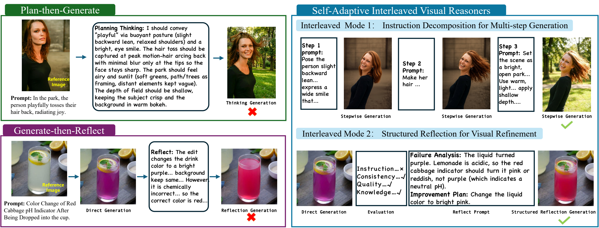

# Interleaved Visual Reasoner 

> Official open-source release of *ICML 2026 Breaking the Dual Bottleneck of Visual Reasoning: An Interleaved Vision-Language Reasoner for Image Generation and Editing.*

<p align="left">
  <a href="https://arxiv.org/abs/XXXX.XXXXX">
    
  </a>
</p>

<p align="center">
  
</p>

## Abstract

Unified vision-language models for image generation and editing are bottlenecked by **two coupled failure modes**: (i) a *planning bottleneck*, where the model commits to a complex instruction in a single forward pass and fails to decompose it into faithful atomic edits; and (ii) a *reflection bottleneck*, where the model has no mechanism to inspect, critique, and correct its own visual outputs. We address both with the **Interleaved Visual Reasoner**, a unified model whose decoding sequence alternates between textual thinking and intermediate image generation. Two complementary modes emerge naturally from this design: **instruction decomposition for multi-step generation**, in which the model emits a per-step text plan before producing each intermediate image, and **structured reflection for visual refinement**, in which the model evaluates a draft image along consistency / instruction / quality / knowledge axes and synthesises a corrected one. We supply (1) a data-construction pipeline that distils these trajectories from raw editing and T2I samples, (2) format-agnostic SFT data converters, and (3) a framework-agnostic RL reward suite with separate final-image, per-step, format, and reflection rewards. Together, these components let any unified vision-language backbone be trained — by SFT alone or SFT + RL — to plan, reflect, and refine before producing the final image.

---

## Repository Overview

This repository provides everything needed to reproduce or extend our training recipe on top of your unified model.

| Stage                 | Folder                              | What it does                                                                                                                  |
| --------------------- | ----------------------------------- | ----------------------------------------------------------------------------------------------------------------------------- |
| 1. Data construction  | [`data_pipeline/`](./data_pipeline) | Generates interleaved (text + image) reasoning trajectories from raw X2I samples via direct edit / reflection / multi-step decomposition. |
| 2. Supervised fine-tuning (SFT) | [`sft/`](./sft)             | Converts pipeline outputs into the chat-style format consumed by your unified vision-language model and SFT framework of choice. |
| 3. Reinforcement learning (RL)  | [`rl/`](./rl)               | Framework-agnostic reward functions that plug into your RL framework of choice. |

The repo is intentionally *framework-agnostic*: every step exposes a clear data contract (JSON in / JSON out) so that you can wire it into your existing training stack with your own unified vision-language model.

---

## 1. Data Pipeline (`data_pipeline/`)

An automated pipeline for generating, evaluating and iteratively improving
image-editing / text-to-image samples. It is built around four sequential stages:

1. **Direct edit** — generate the first candidate with an image-editing /
   T2I model (Gemini by default), or accept a candidate produced by your own
   unified model.
2. **Multi-metric evaluation** — score the candidate on four axes
   (`consistency`, `instruction`, `quality`, `knowledge`) using a vision LLM.
3. **Reflection-based re-editing** — if any metric falls below its
   threshold, ask a reasoning model to analyse what went wrong and re-edit
   the image. Repeat up to `reflection_attempt` times.
4. **Multi-step decomposition fallback** — if reflection still fails,
   decompose the instruction into atomic editing steps and execute them
   sequentially.

Text-to-image samples (`src_path = null`) are fully supported.

### 1.1 Installation

```bash
pip install requests openai pillow
```

Python 3.9+ is recommended.

### 1.2 Configuring API credentials

All credentials live in [`data_pipeline/config.py`](./data_pipeline/config.py)
and default to empty strings. Either **export environment variables** before
running, or edit the defaults inside `config.py` directly. The pipeline talks
to up to four services:

**Gemini image generation / editing** (required) — used by `main.py` for direct
edits, reflection re-edits and multi-step edits:

| Env var                     | Meaning                                          |
| --------------------------- | ------------------------------------------------ |
| `GEMINI_IMG_API_BASE_URL`   | Base URL of the image-generation gateway         |
| `GEMINI_IMG_APP_ID`         | App id for HMAC-SHA256 authentication            |
| `GEMINI_IMG_APP_SECRET`     | App secret for HMAC-SHA256 authentication        |
| `GEMINI_IMG_SOURCE`         | `X-Source` header value (default `python-client`)|
| `GEMINI_IMG_MODEL`          | Model name (default `gemini-3-pro-image-preview`)|

The pipeline POSTs to `<API_BASE_URL>/txt2img/gemini/generate` with HMAC-SHA256
signed headers (`X-AppID`, `X-Source`, `X-Timestamp`, `X-Authorization`). Adapt
the `GeminiImageGenerator` class in `main.py` for a different gateway.

**Reasoning chat model** (required for reflection & multi-step) — used by
`reflect.py` and `multi_step.py`:

| Env var              | Meaning                                          |
| -------------------- | ------------------------------------------------ |
| `CHAT_API_BASE_URL`  | Base URL of the chat gateway                     |
| `CHAT_APP_ID`        | App id                                           |
| `CHAT_APP_SECRET`    | App secret                                       |
| `CHAT_SOURCE`        | `X-Source` header value                          |
| `CHAT_MODEL`         | Model name (default `gemini-3-pro-preview`)      |

**Vision LLM evaluator** (required) — used by `image_scorer.py` to score the four
metrics. Expects an OpenAI-compatible endpoint:

| Env var             | Meaning                                                |
| ------------------- | ------------------------------------------------------ |
| `GPT_API_BASE_URL`  | Base URL of an OpenAI-compatible vision LLM            |
| `GPT_APP_ID`        | App id (sent in HMAC-signed headers)                   |
| `GPT_APP_KEY`       | App key for HMAC-SHA256 signing                        |
| `GPT_SOURCE`        | `X-Source` header value                                |
| `GPT_MODEL`         | Model name (default `gpt-4o`)                          |

**Qwen-VL fallback** (optional) — used by `image_scorer.py` if the primary
evaluator fails. Expects an OpenAI-compatible API (e.g. vLLM):

| Env var               | Meaning                                       |
| --------------------- | --------------------------------------------- |
| `QWEN_API_BASE_URL`   | e.g. `http://localhost:8000/v1`               |
| `QWEN_API_KEY`        | Defaults to `EMPTY`                           |
| `QWEN_MODEL`          | Model id (auto-detected if left empty)        |

If `QWEN_API_BASE_URL` is empty, the fallback is silently skipped.

### 1.3 Input format

Pass a JSON file whose top-level value is a **list of sample dicts**. See
[`data_pipeline/example_json.json`](./data_pipeline/example_json.json) for an
annotated template. Each sample supports:

| Field          | Type                                   | Required | Description                                                                                                                                                                |
| -------------- | -------------------------------------- | -------- | -------------------------------------------------------------------------------------------------------------------------------------------------------------------------- |
| `key`          | `str`                                  | yes      | Unique identifier. Used as the output sub-directory name.                                                                                                                  |
| `src_path`     | `str` &#124; `list[str]` &#124; `null` | yes      | Source image input. A single path for ordinary image editing, a list of paths for multi-reference editing, or `null` for text-to-image (T2I).                              |
| `edit_prompt`  | `str`                                  | yes      | The editing instruction or T2I prompt.                                                                                                                                     |
| `edit_path`    | `str` &#124; `null`                    | yes      | Path to the image produced by **your own unified model** (the candidate output to be evaluated / improved). If non-null, the pipeline copies it as the direct-edit result and scores it directly. Set to `null` to generate from scratch with Gemini. |
| `edit_key`     | any                                    | no       | Free-form metadata. NOT consumed by the pipeline; copied through into `result.json`. Use it for benchmark names, sub-categories, original prompts, etc.                    |
| `explanation`  | `str`                                  | no       | Optional extra context handed to the knowledge evaluator (e.g. real-world facts the edit must respect).                                                                    |

### 1.4 Running

From the **parent directory of `data_pipeline/`** (i.e. `open_source/`):

```bash
python -m data_pipeline.main \
    --input_json   data_pipeline/example_json.json \
    --success_dir  ./outputs/success \
    --fail_dir     ./outputs/fail
```

| Flag             | Default               | Description                                |
| ---------------- | --------------------- | ------------------------------------------ |
| `--input_json`   | (required)            | Path to the input JSON file.               |
| `--success_dir`  | `./outputs/success`   | Where successful samples are stored.       |
| `--fail_dir`     | `./outputs/fail`      | Where failed samples are stored.           |

### 1.5 Output layout

For each sample, the pipeline creates a sub-directory named after `key`:

```
<success_dir>/<key>/
├── result.json
├── original_image.png                   # only if src_path is provided
├── step1_direct_edit_result.png
├── step2_reflect_edit_result_0.png      # if reflection rounds happened
├── step2_reflect_edit_result_1.png
├── step4_multi_step_edit_result_0.png   # if multi-step fallback was used
└── ...
```

`result.json` schema (truncated for readability):

```jsonc
{
  "task_id": "sample_0001",
  "edit_key": { ...verbatim copy of the input edit_key... },
  "original_image_path": "/path/to/source.png",      // or null for T2I
  "edit_prompt": "...",
  "direct_edit_image_path": "...step1_direct_edit_result.png",
  "evaluation": {
    "consistency_score": 4, "consistency_reasoning": "...",
    "instruction_score": 5, "instruction_reasoning": "...",
    "quality_score":     4, "quality_reasoning":     "...",
    "knowledge_score":   4, "knowledge_reasoning":   "..."
  },
  "reflect":    [ { "reflect_thinking": {...}, "reflect_image_path": "...", "evaluation": {...} } ],
  "multi_step": [ { "step_instruction": "...", "step_image_path":  "...", "evaluation": {...} } ],
  "final_edited_image_path": "...",       // populated on success
  "failure_reason":          null,        // populated on failure
  "original_success":        false        // true if input edit_path was accepted as-is
}
```

### 1.6 Tuning the pipeline

All knobs live in the `Config` class in [`data_pipeline/main.py`](./data_pipeline/main.py):

* `direct_edit_evaluation_thresholds` — minimum scores to accept the direct edit and skip reflection.
* `reflection_attempt` — max reflection rounds (default 3).
* `reflection_evaluation_thresholds` — minimum scores to accept a reflection-edited result.
* `use_multi_step` — whether to fall back to multi-step decomposition.
* `multi_step_attempt` — per-step retry budget.
* `multi_step_evaluation_thresholds` — minimum scores per atomic step.
* `use_explanation` — whether to pass `explanation` to the knowledge evaluator.

---

## 2. Supervised Fine-Tuning (`sft/`)

This folder turns the trajectories produced by `data_pipeline/` into the
chat-style records consumed by mainstream SFT frameworks. Plug the output
JSONL into your unified vision-language model's SFT framework of choice
(LLaMA-Factory, ms-swift, transformers/TRL `SFTTrainer`, OpenRLHF, …).

### 2.1 From pipeline output to interleaved trajectory

Each successful sample produced by `data_pipeline` is a directory containing
a `result.json` and a sequence of PNGs. The converter assembles them into an
**interleaved reasoning trajectory**:

```text
USER  : <instruction>  +  <source image (or none)>
ASSIST: <think> initial plan </think>
        <image>  step1_direct_edit_result.png  </image>
        <think> reflection 1 — what is wrong, how to fix </think>
        <image>  step2_reflect_edit_result_0.png </image>
        ...
        <think> final summary </think>
        <image>  final image </image>
```

* The `<think>` content comes from the editing-step decomposition
  (`multi_step`) for the initial plan, and from the `reflect_thinking`
  fields for each reflection round.
* The image sentinel (default `<image>`) is a placeholder that your
  tokenizer will replace with the model-specific visual-token sequence
  (e.g. `<|image|>` for many VLMs).

### 2.2 Output schemas

`prepare_sft_data.py` can emit three popular SFT formats, selected with
`--format`:

**`sharegpt`** (default, LLaMA-Factory / ms-swift):

```jsonc
{
  "conversations": [
    {"from": "human", "value": "<image>\n<edit_prompt>"},
    {"from": "gpt",   "value": "<think>...</think><image>...</image><think>...</think>..."}
  ],
  "images": ["/abs/path/source.png", "/abs/path/step1.png", "/abs/path/step2_0.png", ...]
}
```

**`messages`** (OpenAI-style):

```jsonc
{
  "messages": [
    {"role": "user",      "content": [{"type": "image", "image": "..."}, {"type": "text", "text": "..."}]},
    {"role": "assistant", "content": [{"type": "text", "text": "<think>..."},
                                       {"type": "image", "image": "..."},
                                       {"type": "text", "text": "..."}]}
  ]
}
```

**`chatml`** (raw text with sentinel tokens): a single `text` field
containing `<|im_start|>user ... <|im_end|><|im_start|>assistant ... <|im_end|>`
where images are inlined as `<image>{path}</image>` placeholders. Pair this
with your own collator.

### 2.3 Usage

```bash
python sft/prepare_sft_data.py \
    --pipeline_root ./outputs/success \
    --out_file      ./sft_data.jsonl \
    --format        sharegpt
```

| Flag                | Default       | Meaning                                                                                   |
| ------------------- | ------------- | ----------------------------------------------------------------------------------------- |
| `--pipeline_root`   | (required)    | Root of the `success` directory produced by `data_pipeline`.                              |
| `--out_file`        | (required)    | Output `.jsonl` file (one trajectory per line).                                           |
| `--format`          | `sharegpt`    | `sharegpt` / `messages` / `chatml`.                                                       |
| `--image_token`     | `<image>`     | Sentinel used to mark image positions inside text. Set this to whatever your tokenizer expects (e.g. `<|image|>`). |
| `--think_open`      | `<think>`     | Opening sentinel for textual reasoning blocks.                                            |
| `--think_close`     | `</think>`    | Closing sentinel for textual reasoning blocks.                                            |
| `--skip_no_reflect` | `False`       | If set, drop trajectories that contain neither a reflection round nor a multi-step plan.  |
| `--max_reflect`     | `unlimited`   | Cap on the number of reflection rounds kept per trajectory.                               |

### 2.4 Choosing an SFT framework

Any framework that accepts one of the three formats above will work. Tested combinations:

| Framework                           | Format        | Notes                                                          |
| ----------------------------------- | ------------- | -------------------------------------------------------------- |
| LLaMA-Factory                       | `sharegpt`    | Use `"image"`/`"video"` columns; set `template` per VLM.       |
| ms-swift                            | `sharegpt`    | Use `--dataset custom` and point `dataset_info.json` at it.    |
| transformers / TRL `SFTTrainer`     | `messages`    | Provide your own multimodal collator.                          |
| OpenRLHF (SFT path)                 | `messages`    | Custom dataset class.                                          |
| Your own loop                       | any           | The file is plain JSONL — write a short collator.              |

> **Tip:** Whatever framework you pick, double-check that the image token in
> the dataset matches the image token in the tokenizer's vocabulary.
> Mismatches here are the most common silent failure mode for VLM SFT.

The resulting checkpoint is the input to the RL stage.

---

## 3. Reinforcement Learning (`rl/`)

The RL stage ships the **reward functions** described in the paper,
decoupled from any specific RL framework. Plug them into your GRPO / PPO /
RLOO / REINFORCE trainer (TRL, OpenRLHF, verl, or a hand-rolled loop) and
call `compute_total_reward(rollout, judge)` on each rollout.

```python
from rl.rewards import compute_total_reward

def judge(prompt: str, images: list[str]) -> str:
    """Send (prompt, images) to your favourite VLM and return its text."""
    ...

reward, info = compute_total_reward(rollout, judge)
```

* `reward` is a scalar in `[0, 1]` — feed it directly to your trainer.
* `info` contains the per-component scores and the judges' reasoning,
  useful for logging and reward debugging.

### 3.1 Reward components

The total reward is a convex combination of four independent terms. Each is
implemented as a self-contained function so you can use, weight, or replace
them individually:

| Component           | File                             | Calls VLM? | What it scores |
| ------------------- | -------------------------------- | ---------- | -------------- |
| `final_reward`      | `rewards/final_reward.py`        | yes        | The **last** image, on four axes: consistency, instruction-following, quality, knowledge. |
| `step_reward`       | `rewards/step_reward.py`         | yes        | Each **intermediate** image against the textual sub-instruction that preceded it. |
| `format_reward`     | `rewards/format_reward.py`       | no         | Surface-form compliance with the `<think>…</think><image>…</image>` protocol. |
| `reflection_reward` | `rewards/reflection_reward.py`   | yes        | Whether each **reflection** correctly diagnosed the previous image and led to a better next one. |

Default weights (override via `compute_total_reward(..., weights=...)`):

```python
DEFAULT_WEIGHTS = {"final": 0.40, "step": 0.30, "format": 0.10, "reflection": 0.20}
```

If a rollout has no intermediate steps (pure T2I) or no reflections, the
corresponding weight is set to 0 and the remaining weights are renormalised
automatically (`skip_empty=True`, the default).

### 3.2 The step-evaluation prompt

The per-step evaluation prompt lives in
[`rl/rewards/prompts.py`](./rl/rewards/prompts.py) as `PROMPT_STEP_REWARD`. It
is derived from the instruction-following prompt used by the data pipeline
and adapted to **process supervision**:

* It asks the judge to compare the *previous* image and the *current* image
  in light of the **sub-instruction** the model emitted as its inner
  thought, **not** the global instruction.
* It still passes the global instruction as context but the judge is told
  *not* to require the current image to already satisfy the global goal.
* It returns an integer in `[1, 5]` plus reasoning, which the reward
  function rescales to `[0, 1]`.

See `prompts.py` for the full text of all five prompts (4 final-image axes +
1 step prompt + 1 reflection prompt).

### 3.3 Rollout schema

The rollout is a plain `dict`. See
[`rl/example_rollout.json`](./rl/example_rollout.json) for a complete worked
example:

```jsonc
{
  // user request
  "instruction": "Change the dog's collar to red and add a small bell on it.",

  // source images (omit or [] for pure T2I)
  "source_images": ["/path/to/source.jpg"],

  // optional world-knowledge note used by the "knowledge" axis of final_reward
  "explanation": "A bell should hang due to gravity; collar follows the neck.",

  // raw model output (used by format_reward only)
  "assistant_text": "<think>...</think><image>step_1.jpg</image>...",

  // intermediate generations, each with the sub-instruction that produced it
  "intermediate_steps": [
    {"instruction": "Recolor the collar to red.", "image": "/p/step_1.jpg"},
    {"instruction": "Add a bell.",                "image": "/p/step_2.jpg"}
  ],

  // last generated image (the final answer)
  "final_image": "/p/step_2.jpg",

  // explicit reflection records: prev image → textual critique → next image
  "reflections": [
    {
      "prev_image": "/p/step_1.jpg",
      "text":       "No bell yet; add a small bell to the front of the collar.",
      "next_image": "/p/step_2.jpg"
    }
  ]
}
```

You can build this dict directly during your sampling loop, or post-process
the model's raw `<think>` / `<image>` stream after each rollout.

### 3.4 The `judge` callable

A reward "judge" is any function with the signature

```python
judge(prompt: str, images: List[str]) -> str
```

that returns the **raw text response** of a vision-language model. The
prompts are designed to elicit strict JSON (e.g.
`{"step_score": 4, "reasoning": "..."}`), and the parser in
`rewards/_utils.py` is tolerant of code-fenced or prose-wrapped JSON.

Minimal OpenAI-style adapter (works with GPT-4o, Gemini, or any local
vLLM/SGLang server exposing the OpenAI API):

```python
from openai import OpenAI
import base64, mimetypes

client = OpenAI()  # configure base_url / api_key for any compatible server

def _img_part(path: str) -> dict:
    mime = mimetypes.guess_type(path)[0] or "image/jpeg"
    with open(path, "rb") as f:
        b64 = base64.b64encode(f.read()).decode()
    return {"type": "image_url",
            "image_url": {"url": f"data:{mime};base64,{b64}"}}

def judge(prompt: str, images: list[str]) -> str:
    content = [{"type": "text", "text": prompt}] + [_img_part(p) for p in images]
    r = client.chat.completions.create(
        model="gpt-4o-mini",
        messages=[{"role": "user", "content": content}],
        temperature=0.0,
    )
    return r.choices[0].message.content
```

### 3.5 Plugging into RL frameworks

The reward functions are **pure Python** — no Torch, no NCCL — so any
trainer can call them.

**TRL `GRPOTrainer`:**

```python
from rl.rewards import compute_total_reward

def trl_reward_fn(prompts, completions, **kwargs):
    rewards = []
    for p, c in zip(prompts, completions):
        rollout = build_rollout(p, c)   # your sampling loop already has this
        r, info = compute_total_reward(rollout, judge)
        rewards.append(r)
    return rewards
```

Pass `trl_reward_fn` to `GRPOTrainer(..., reward_funcs=[trl_reward_fn])`.

**OpenRLHF** expects a `RewardModel` interface. Wrap `compute_total_reward`
in a class whose `forward(samples)` returns a tensor of rewards.

**verl** uses `reward_fn(data: DataProto) -> torch.Tensor`. Iterate over the
batch, construct rollout dicts, call `compute_total_reward`, and return a
1-D tensor of length `batch_size`.

**Hand-rolled GRPO / REINFORCE**: just call `compute_total_reward` inside
your rollout loop and subtract a group baseline.

### 3.6 Cost & caching tips

* The judge is called **`4 + n_steps + n_reflections`** times per rollout.
  For long reflective trajectories this dominates training cost; cache by
  `(prompt_hash, tuple_of_image_paths)` if you re-sample with the same
  context.
* Set `temperature=0` on the judge for reproducibility.
* Use a smaller VLM (e.g. Qwen2.5-VL-7B) for `step_reward` and
  `reflection_reward`; keep a stronger VLM only for `final_reward`. You can
  pass different judges per component by composing your own version of
  `compute_total_reward`.
* For early training, set `weights = {"format": 1.0, ...}` (zero out the
  others) to first stabilise the interleaved output protocol — this is free.

---

## Citation

If you find this work useful, please cite our paper using the official
ICML 2026 bibtex format:

```bibtex
@inproceedings{interleaved_visual_reasoner_2026,
  title     = {Breaking the Dual Bottleneck of Visual Reasoning:
               An Interleaved Vision-Language Reasoner for Image Generation and Editing},
  author    = {Liu, Qingyang and Gao, Bingjie and Fu, Canmiao and Huang, Zhipeng and
               Li, Chen and Wang, Feng and Chang, Shuochen and Wang, Shaobo and
               Wang, Yali and Ye, Keming and Li, Jiangtong and Niu, Li},
  booktitle = {Proceedings of the 43rd International Conference on Machine Learning},
  series    = {Proceedings of Machine Learning Research},
  year      = {2026},
  publisher = {PMLR},
}
```

